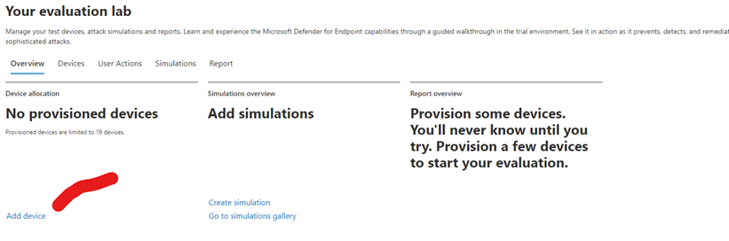
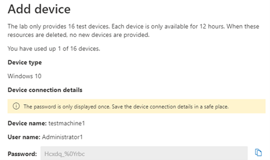
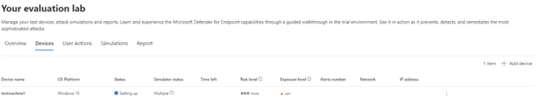
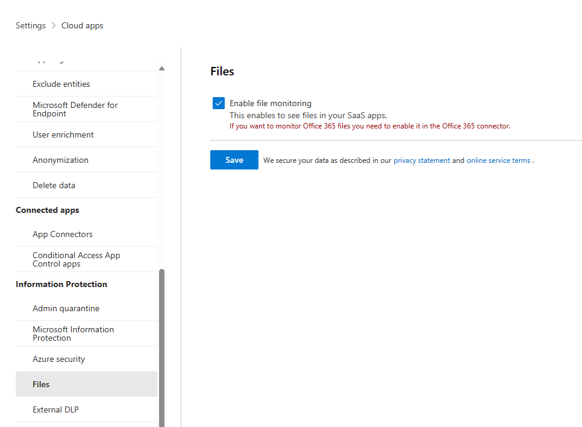
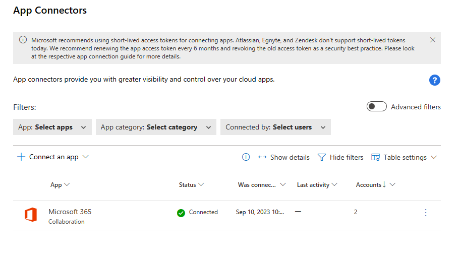
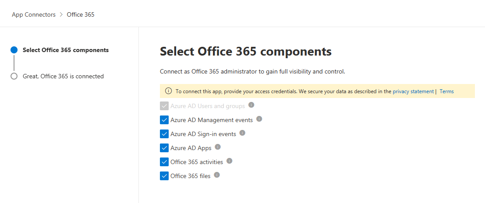

# Preparation for the LAB

## Provision a device in the Microsoft Defender for endpint evaluation lab

> **To setup the lab, do the "Enable the Defender for Endpoint Evaluation LAB" in the prerequisites section**

then ..

Provision a test device:
1.	In the "Evaluation lab" screen, Click on "Add device" and select the default Windows 10 machine with Java, Office, Python, Sysinternals.

 
2.	Remember to Copy and paste the Username and Password for the machine.

3.	The device will now be provisioned in the back ground. When done Create one more machine.
 

   

## Connect apps to Defender for Cloud App

To get insight into Office 365 activities and files the app must be connected in MCAS and files scanning must be enabled.

*Files*
https://security.microsoft.com -> Settings -> Cloud Apps -> Files
Deep link: https://security.microsoft.com/cloudapps/settings?tabid=filesSettings&tid=dc23f235-b018-4e6c-98d2-3a51deb241ba

Check the "Enable file monitoring" box and click Save

Goto:
https://security.microsoft.com -> Settings -> Cloud Apps -> App Connectors

Click “Connect an app” and Choose “Office 365”
 

Choose all components and click connect. Authenticate with your admin user.

#### INITIAL CONFIGURATION OF MCAS

Initial configuration is done in the Cloud Apps section in the M354 Settings page.

https://security.microsoft.com -> Settings -> Cloud Apps

Deep link: https://security.microsoft.com/cloudapps/settings?tabid=about&tid=dc23f235-b018-4e6c-98d2-3a51deb241ba

Scroll down to “Microsoft Defender for Endpoint” in the Settings menu
-	Enable “Enforce app access”
-	Set alerts to "Medium"
- click Save

Scroll down to “User enrichment”
-	Enable “enrich discovered user identifiers with Azure Active Directory usernames”
- click save
  

Scroll down to “Microsoft information protection”
-	Enable “automatically scan new files for Microsoft Information Protection sensitivity labels and content inspection warnings”
-	Don’t enable “only scan files for Microsoft Information Protection sensitivity labels and content inspection from this tenant”
-	Grant permission to inspect protected files

### Licensing

If not already done so, assign a Microsoft 365 E5 license to all your test users.
(Remember to spesify the "usage location" on the user to be able to assign a license)
