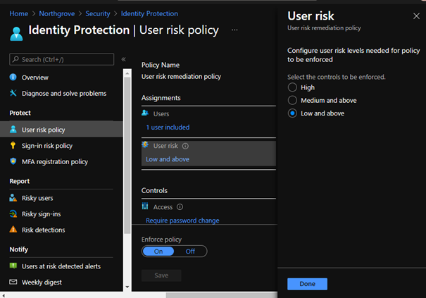

# Azure Active Directory Identity Protection

### Setup and configuration

Configure Azure AD Identity protection risk policies - [Azure AD Identity Protection policies | Microsoft Docs](https://docs.microsoft.com/en-us/azure/active-directory/identity-protection/concept-identity-protection-policies)

Configuration is done in the Azure Portal -> https://portal.azure.com -> Azure Active Directory -> Security -> Identity Protection

Deep link: [Identity Protection - Microsoft Azure](https://portal.azure.com/#blade/Microsoft_AAD_IAM/IdentityProtectionMenuBlade/Overview)

**Create an MFA Registration Policy**

Assignments: *All users*
Controls: *Require Azure AD MFA registration*
Enforce policy: *On*
*Click save*

This policy will enforce all users in the tenant to register for MFA. An MFA registration wizard will appear during login. The users have the option to postpone the MFA registration up to 14 days.

**Create a risky user policy**

Assignments: Assign this policy only to “testUser1”

User risk: choose “Low and above”

Controls: Allow access + require password change

**Create a risky sign-in policy**

Assignments: Assign this policy only to “testUser1” and “testuser2”

Sign-in risk: choose “Low and above”

Controls: Allow access + require multi-factor authentication

  

#### Risk based Conditional access policies

Configuration of Conditional Access is done in the https://portal.azure.com -> Azure Active Directory -> Security -> Conditional Access

Deep link: [Conditional Access - Microsoft Azure](https://portal.azure.com/#blade/Microsoft_AAD_IAM/ConditionalAccessBlade/Policies)

Create a new Conditional Access policy with the following configuration:

| Name	 | Block risky users |
|-|-|
|Users and groups|	Choose your “testuser1”, “testuser2” and “testuser3”|
|Cloud Apps -> Selected Apps|	“Office 365 Exchange online”|
|Conditions -> User risk|	“yes” + “low” and “medium” and “high”|
|Grant|	“Block access”|
|Enable policy|	“On”|

This policy will block users with any level of user risk from accessing Office 365 Exchange Online

### Test scenario - Identity Protection

1.	Anonymous login detection
    -	On your test client, download and install the TOR browser - Tor Project | Download
    -	Start the TOR browser, and connect to the TOR network
    -	Login with your test account “testuser1” to https://portal.azure.com
    -	Sign-in is interrupted with a “risky signin detected”. Cancel the sign-in
        - (if no Suspiciouse activity detected warning sign shows up, interrupt the sign-in, restart the TOR-browser and try sign-in again)
    -	Close the TOR browser.
    -	Re-open the TOR browser and create a new connection to the TOR network.
    -	Login with your test account “testuser2” to https://portal.auzure.com
    -	Sign-in is interrupted with a “risky singin detected”. Complete the MFA verification process and complete the login to portal.azure.com
    Expected result: 
    -	You should get one sign-in risk entry in Azure AD identity protection console for “testuser1”.
    -	You should not get any sign-in risk entry in the Azure AD identity protection console for “testuser2”.  
      

2.	Block risky sign-in with Conditional Access
    -	Start the TOR browser, and connect to the TOR network
    -	Login with your test account “testuser3” to https://portal.azure.com
    -	Sign-in is interrupted with a “risky signin detected”. Cancel the sign-in
    o	(if no Suspiciouse activity detected warning sign shows up, interrupt the sign-in, restart the TOR-browser and try sign-in again)
    -	Start a regular browser and login to portal.office.com with “testuser3”
    -	Try accessing the outlook app in portal.office.com  
    Expected result: 
    -	User is blocked by Conditional access to access the outlook app

**Tasks - Identity protection**
Use Advanced Hunting in M365 Defender Console or the Sign-in log to answer:
(NB! It may take up to 30min before the event is shown in the sign-in log console)
1.	From witch location did testuser1 try to sign in?
2.	What is the OS and browser version/Client agent detected for testuser2?
3. What is the detection type and Risk level for the login atempt?

