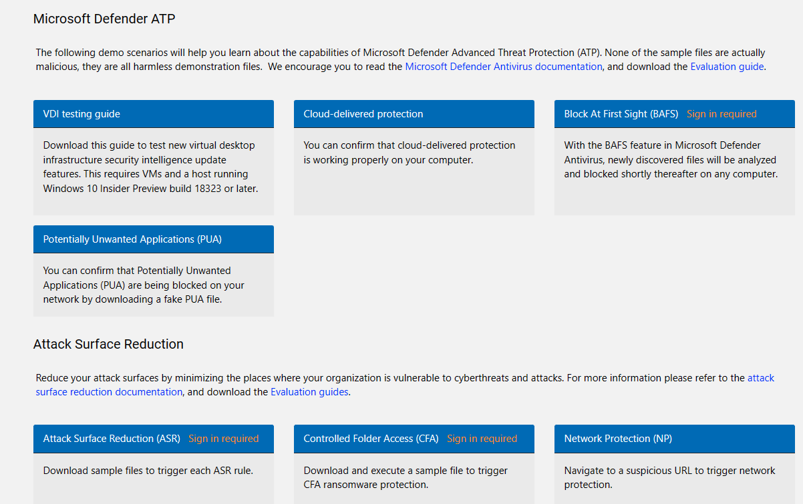

# Defender for Endpoint

## Setup and Configuration

Pre-requisite for testing Defender for Endpoint is that you have a Newly installed Virtual machine or physical machine (Local, ESXI, Hyper-V etc.). 

If you don’t have a machine you can use the Microsoft Defender Evaluation lab and provision a Windows client there. Look at the end of this document in the Appendix chapter to find a walkthrough.

### Intune integration and configuration policies

Open the Endpoint manager console with the URL – https://endpoint.microsoft.com


**Security Baselines**

1.	Navigate to Endpoint Security, click on Security Baselines - > Click "Security Baseline for Windows 10 and later" .
2.	Click on Create profile.
3.	Provide a Name and Click Next

 

4.	Click Next on configuration settings
5.	Click Next on Scope tags
6.	Click Next on Assignments (dont add any users/devices)
7.	Click Create.


**Security Policies**

1.	Navigate to Endpoint Security, click on Antivirus
2.	Click Create Policy
3.	In the Dropdown box select Windows 10 and later
4.	Windows Security Experience and Click Create
5.	Provide a Name and Click Next
6.	Make Sure the following is enabled (Tamper Protection and Hide Family Options)

 

7.	Click Next on Configuration settings
8.	Click Next on Scope tags
9.	On Assignments - Click "Add all users" - Click Next
10.	Click Create

Back in the Console

1.	Click Create Policy
2.	In the Dropdown box select Windows 10 and later
3.	Microsoft Defender Antivirus and Click Create
4.	Provide a Name and Click Next
5.	Make sure the following is enabled.

 

 

 
  
6.	Click Next on Configuration settings
7.	Click Next on Scope tags
8.	On Assignments - Click "Add all users" - Click Next
9.	Click Create

**Endpoint Detection and Response**

Go to "Microsoft Defender for Endpoint" in the Endpoint Security menu

Make sure to enable at least "Connect Windows Devices version 10.0.15063 and above to Microsoft Defender for Endpoint" and "Allow Microsoft Defender for Endpoint to enforce Endpoint Security Configurations"

Include also any other settings you may want to test out later


Click "Save"

**Endpoint Detection and response policy**
1.	Navigate to Endpoint Security, click on Endpoint Detection and Response
2.	Click Create Policy
3.	In the Dropdown box select Windows 10 and later
4.	Select Endpoint Detection and Response Click Create
5.	Provide a Name and Click Next
6.	Select the following and click Next

8.	Click Next on Configuration settings
9.	Click Next on Scope tags
10.	On Assignments - Click "Add all users" - Click Next
11.	Click Create

**Attack surface reduction**
1.	Navigate to Endpoint Security, click on Attack Surface Reduction 
2.	Click Create Policy
3.	In the Dropdown box select "Windows 10, Windows 11 and Windows Server"
4.	Select Attack Surface Reduction Rules, Click Create
5.	Provide a Name and Click Next
6.	Select the following and click Next
 
7.	Click Next on Configuration settings
8.	Click Next on Scope tags
9.	On Assignments - Click "Add all users" - Click Next
10.	Click Create

### Test Scenario

The testscenario requires a device enroll to intune and Defender for Endpoint.

**Test Attack Surface Reduction**


https://demo.wd.microsoft.com/ - contains several test scenarios for Defender and ASR

Run the following test scenarios:
- Attack Surface Reduction (ASR)
- Network Protection
- Block At First Sight (BAFS)

Malicious file download:
https://aka.ms/ioavtest (clicking on the link will trigger download of a malicious file)

Download Sysinternals - procdump from the following site:
[Sysinternals Utilities - Windows Sysinternals | Microsoft Docs](https://docs.microsoft.com/en-us/sysinternals/downloads/)
Start a command line and run the following procdump command:
``` 
procdump lsass.exe
```

Download Mikiatz or similar tools to try to extra identity information from lsass.exe:

https://github.com/gentilkiwi/mimikatz/releases

To be able to download and run Mimikatz you may need to disable som Defender for Endpoint first in line defense mechanisem like Smart Screen.

> **Important:**
> Dont do any of theese test on a production machine

Review the report for detections and what’s blocked in security.microsoft.com console for ASR rules. 


### Tasks - Defender for Endpoint

1. Write a KQL query that shows enabled ASR rules on your machines
2. 
