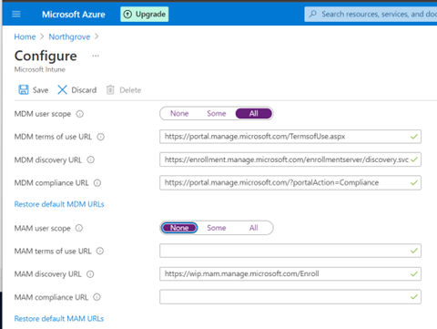
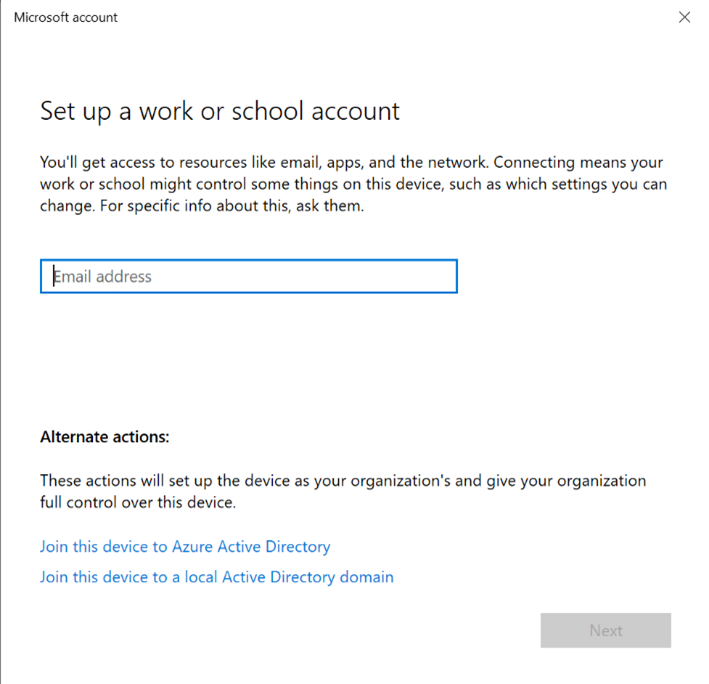
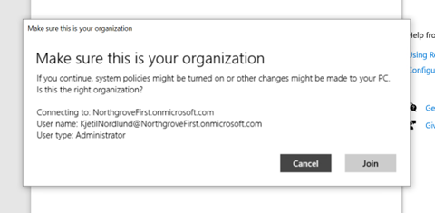
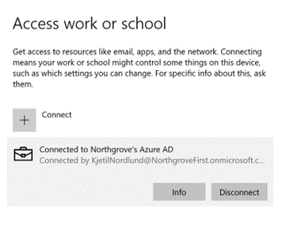
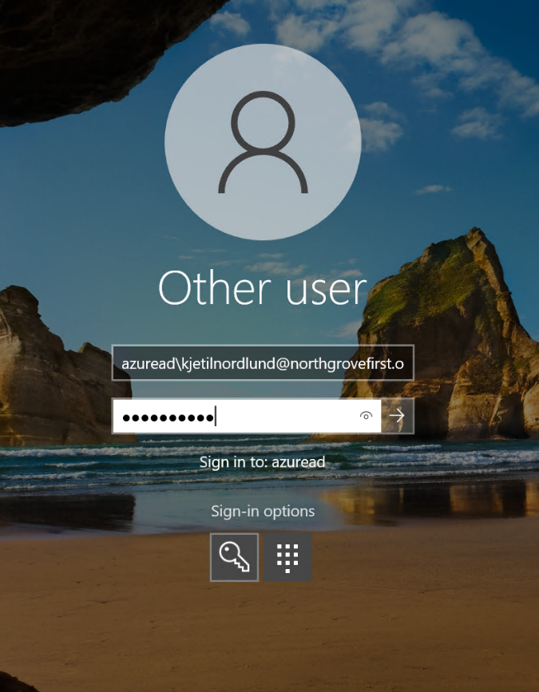
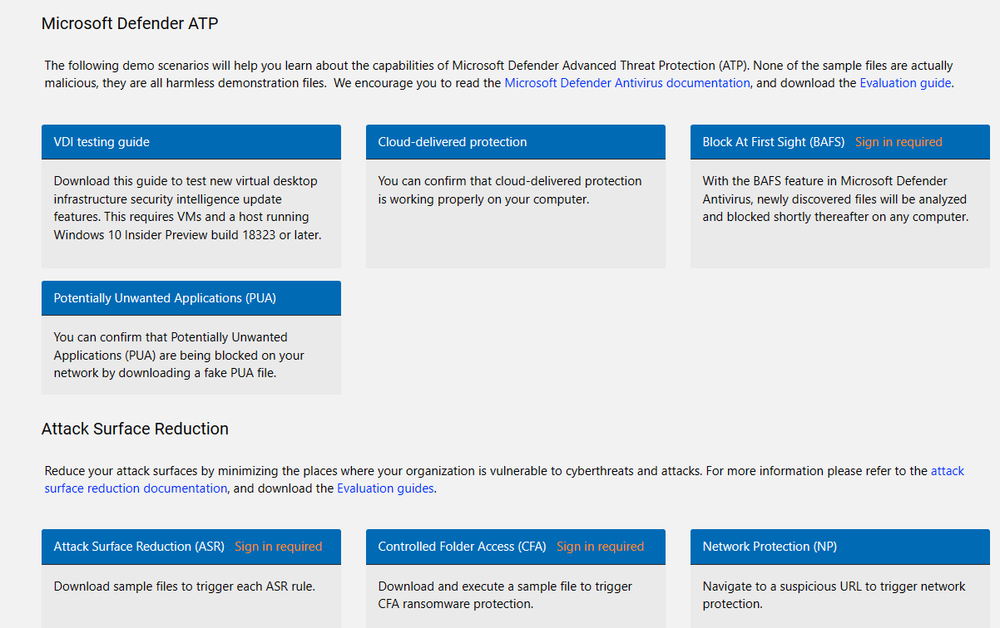
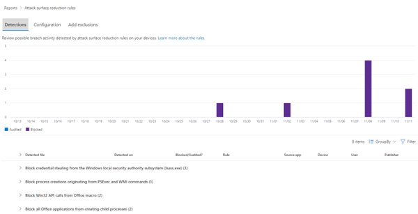

# Enroll Your Test machine to Intune
If you are going to use the Evaluation LAB machine as your test machine, you need to disable NLA.To be able to Add the machine to Azure AD and Endpoint Manager – *NB! Only needed for VM in Azure or Evaluation LAB*.

  
**DISABLE NETWORK LEVEL AUTENTICATION (NLA) – NOT RECOMMENDED IN PRODUCTION**
Open Remote Desktop and Log in to the device with the Provided Username and Password.

Run this powershell script in and administrator elevated powershell prompt:
```
Write-Output 'Configuring registry to disable Network Level Authentication (NLA).'
$path = 'HKLM:\SYSTEM\CurrentControlSet\Control\Terminal Server\WinStations\RDP-Tcp'
Set-ItemProperty -Path $path -Name SecurityLayer -Type DWord -Value 0
Set-ItemProperty -Path $path -Name UserAuthentication -Type DWord -Value 0
Set-ItemProperty -Path $path -Name fAllowSecProtocolNegotiation -Type DWord -Value 0
Write-Output 'Restart the VM for the change to take effect.'
```
Reboot the machine


## Intune enrollment

Verify that autoenrollment in Azure AD is enabled: Azure Active Directory > Mobility (MDM and MAM) > Microsoft Intune

 

Set ”MDM user scope” to all. Click Save

Login to your testmachine with “Administrator1” and the provided password.

Go to: Start -> Settings -> Accounts -> Access Work or School
Click “Connect”

 

Make sure to click on ”join this device to Azure Active Directory”

Enter the email address to your first Azure AD account, and login

  

Click join
Click done

  

Verify that your computer is connected to your environment (both Azure AD and Intune)

Restart your computer



Login to the computer with your first Azure AD account
To be able to login you must type azuread\ in front of your email address

Wait for intune configuration profiles to be delivered

<br><br>
### Test Scenario

The testscenario requires a device enroll to intune and Defender for Endpoint.

**Test Attack Surface Reduction**


https://demo.wd.microsoft.com/ - contains several test scenarios for Defender and ASR

Run the following test scenarios:
- Attack Surface Reduction (ASR)
- Network Protection
- Block At First Sight (BAFS)

Malicious file download:
https://aka.ms/ioavtest (clicking on the link will trigger download of a malicious file)


Download Sysinternals - procdump from the following site:
[Sysinternals Utilities - Windows Sysinternals | Microsoft Docs](https://docs.microsoft.com/en-us/sysinternals/downloads/)

Start a command line and run the following procdump command:
``` 
procdump lsass.exe
```

Download Mikiatz or similar tools to try to extra identity information from lsass.exe:

https://github.com/gentilkiwi/mimikatz/releases

To be able to download and run Mimikatz you may need to disable som Defender for Endpoint first in line defense mechanisem like Smart Screen.

TIP: Create an exclusion folder, i.e c:\demo, in Defender for Endpoint and download mimikatz to that folder.

```
Example Mimikatz command sequence to run:

#> privilege::debug
#> token::elevate
#> sekurlsa::minidump lsass.dmp
#> sekurlsa::logonpasswords


```

> **Important:**
> Dont do any of theese test on a production machine

Review the report for detections and what’s blocked in security.microsoft.com console for ASR rules. 


### Tasks - Defender for Endpoint

1. Write a KQL query that shows ASR rules activity on your machines
2. Are you able to show a report of enabled ASR rules on the devices?
