# Defender for Office 365

## Setup and Configuration

Security policies can be configured as,
1.	Assign preset security policies automatically Preset Security Policy standard or strict.
    If no need to customize the setup, this will keep the customer at recommended settings, however most customers need some kind of customization.
2.	Configure baseline protection manually Custom
•	Anti-malware protection in EOP
•	Anti-phishing protection in EOP and Defender for Office 365
•	Anti-spam protection in EOP
•	Protection from malicious URLs and files 
•	Safe Links
•	Safe Attachments

In Security.microsoft.com console navigate to Policies & Rules in the Email and Collaboration.

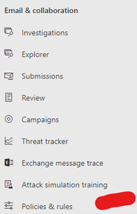

Click on Threat policies

We are going to focus on Anti-phishing policies Safe Attachments, Safe Links.  

### Anti-Phising

Refer to the recommended settings to determine Default, Standard og Strict settings:
[anti-phishing policies Default, Standard, Strict](https://docs.microsoft.com/en-us/microsoft-365/security/office-365-security/recommended-settings-for-eop-and-office365?view=o365-worldwide#advanced-settings-in-anti-phishing-policies-in-microsoft-defender-for-office-365)

1.	Click on Anti-phishing and create a new Policy
2.	Give the policy a Name

 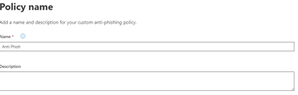

3.	Add your tenant domain(s)

 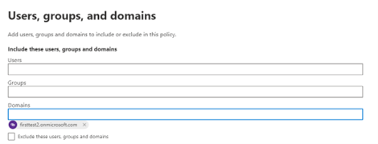

4.	Move the Phishing email threshold slider to 2-Aggressive

 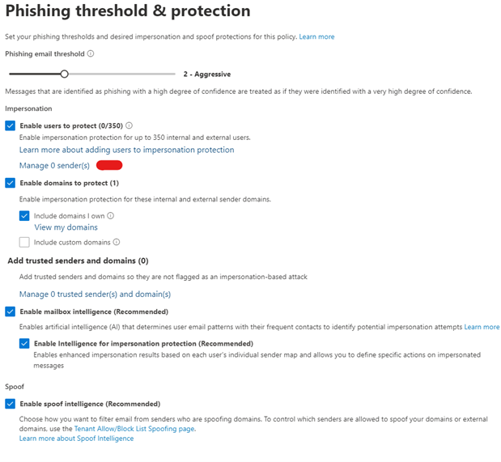

6.	Click on manage 0 sende(s) - add your test users

 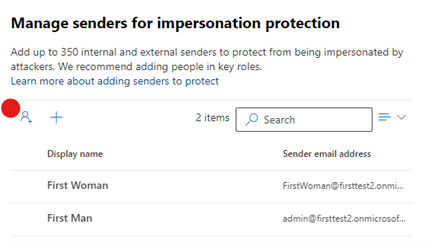

8. Click Next
9. Select "Move message to the recipients Junk Email folder" as most actions

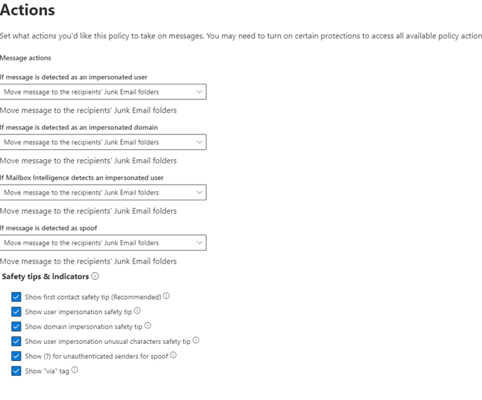

1.  Click next and done

**Test impersionation**

Create a new or use and existing Email account for Impersonation test. 
Email address need impersonate a user in your tenant. 

Example: - User1@kents-events.com - User1@firsttest2.onmicrosoft.com  will trigger the impersonation protection settings in Anti phishing policy

### Safe Attachments

***Global Settings***

Safe attachments is extra layer of protection known as Sandbox detonation.
For reference to Default, Standard or strict setting open the [Safe Attachments](https://docs.microsoft.com/en-us/microsoft-365/security/office-365-security/recommended-settings-for-eop-and-office365?view=o365-worldwide#safe-attachments-policy-settings) doc.

1. In Threat policies, click on Safe Attachments.
2. Open Global Settings (Global means tenant wide settings)

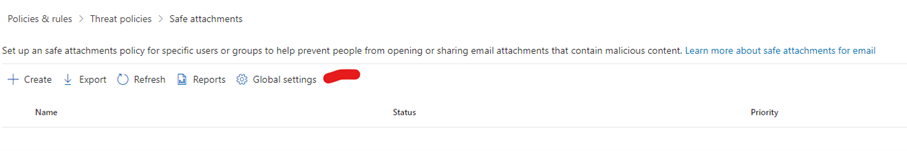

3. Activate Global Settings for:
    •	Defender for O365, SharePoint, OneDrive, and Microsoft Teams
    •	Safe Documents for Office Client.

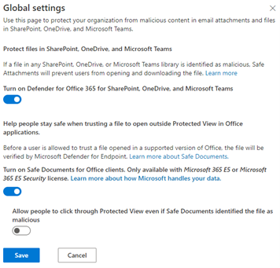

***Policy Settings***

1.	Create a new Policy

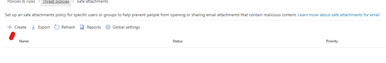

2.	Give the Policy a Name and a Description 
  
3.	Add your domain(s) to the policy

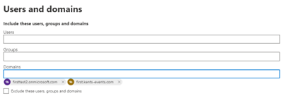 

Add exclusions if you need to Bypass the Sandbox for any reason.

4.	Configure the behavior of the Sandbox.

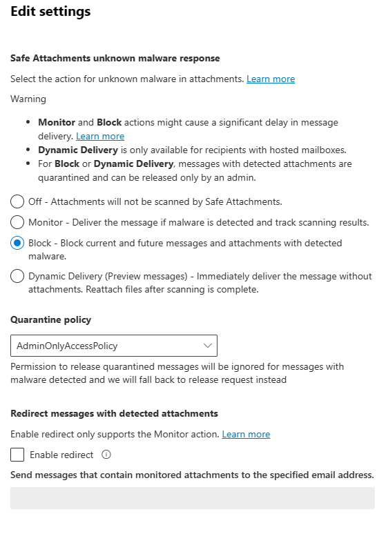 
 

**Test Safe Attachments**

For Sandbox to be triggered we need to send an email to a protected user with an attachment that is not yet scanned by any Defender service. 

From a Machine with a Excluded folder or a machine with EPP that is not Defender. 
1.	Download a test file with the number you are assigned from https://github.com/northgrove/M365DefenderTraining/tree/main/MaliciousFiles (eks : MaliciouseFile17.doc if you are assigned nr 17)
2.	Send the testfile as Attachment to an email address on your tenant.
3.	From Exchange Message Trace, search for the email and look for the following :
Reason: 400 4.7.721 Advanced Threat Protection scanning in progress.

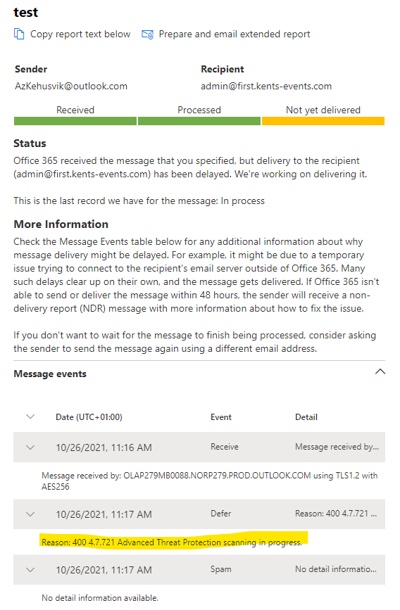 

**Questions**
1. What is the resulting "Delivery action" for the email?
2. What is the "family name" of the malware found in the email attachment?

 ### Safe Links
Safe Links helps prevent your users from following links in email and documents that go to web sites recognized as malicious. 
Time of click Protections

 ***Global Settings***
Open Global Settings and Make Sure – Use Safe Links in Office 365 is Enabled. This will make Sure Safe Link work in Office Applications like Work, Excel, Power Point etc..

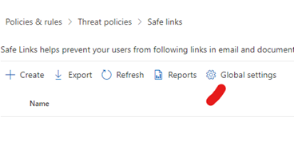 

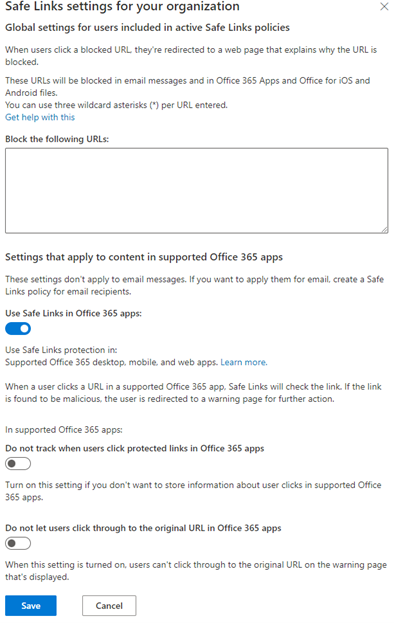 

***Policy Settings***

1.	Create a new Safe Links Policy

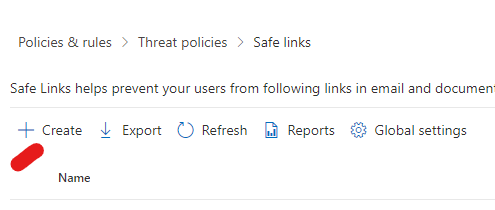 

2.	Give the Policy a Name and a Description  

3.	Add your domain(s) to the policy  

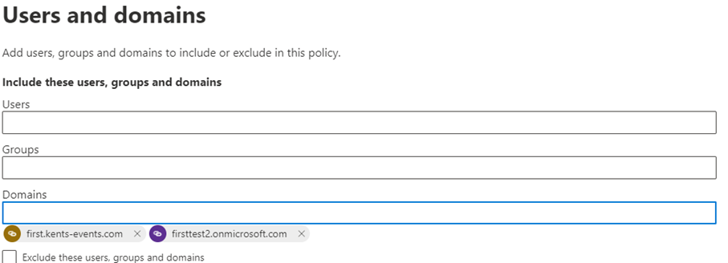 

4.	Activate following settings

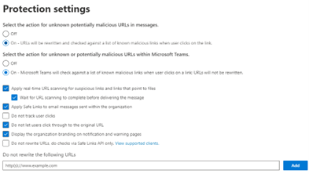 

5.	Use the default notification and Submit the policy.

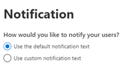 

**Test Safe Links**
Send an Email with the following link included https://smartscreentestratings2(.)net/ - Remove the () from the URL. 

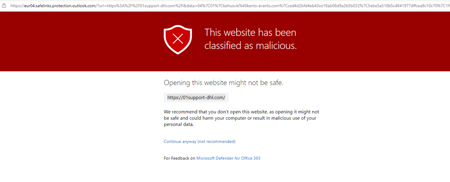 