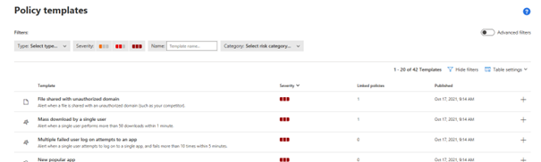
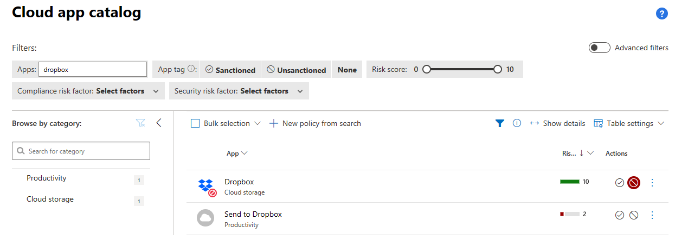

# Microsoft Defender for Cloud

## Setup and configuration

#### CREATE A POLICY FROM EXISTING TEMPLATE
https://security.microsoft.com -> "Cloud apps" section -> Policies -> Policy templates

Scroll down to or search for “mass download by a single user”

 Deep link: https://security.microsoft.com/cloudapps/policies/templates?name=eq(mass%2520download)&tid=dc23f235-b018-4e6c-98d2-3a51deb241ba

Click on the + sign in the colum to right for that policy template

Configure the policy to reflect sensible settings. In this scenario we do set a configuration that’s makes it easy to trigger an alert:
-	Repeated activity:
o	Minimum repeated activities: 5
o	Whitin timeframe: 5 minutes
-	Turn of the “count only unique target files or folders pr user”
-	Create the Policy

#### UNSANCTION AND BLOCK ACCESS TO Dropbox
Search for Dropbox in the Cloud app catalog

https://security.microsoft.com -> "Cloud apps" section -> Cloud App Catalog -> search for “dropbox”

Deep link: https://security.microsoft.com/cloudapps/app-catalog?text=contains(o:(searchType:i:1,adv:b:false),dropbox)&tid=dc23f235-b018-4e6c-98d2-3a51deb241ba

 

In the Actions column, click on the   icon for the Dropbox app.
Confirm that you want to block the app.

With this Defender for Cloud Apps will put the URL identifier for Dropbox as a Custom Indicator in Defender for Endpoint. Defender for Endpoint with network protection will then block any access to that URL from the device.

### TEST SCENARIO

**MASS DOWNLOAD OF FILES FROM OFFICE 365**
Log inn to https://portal.office.com with your testuser3
-	Start Teams
-	Create a new Team
-	Access the files tab
-	Create 6 new Office 365 files with random content ( =rand() )
-	Download each of the 6 files to your computer, one by one, within 5minutes.

*Expected result:*
An alert about “Mass download by single user” are created in MCAS

**BLOCKED ACCESS TO FACEBOOK FROM DEVICE**
Log inn to your test computer, enabled with Microsoft Defender for Endpoint
-	Try access www.dropbox.com from a browser session

*Expected result:*
-	Smart screen will block access to www.dropbox.com showing a red alert page
-	An alert is triggered in Defender for Endpoint

