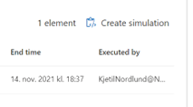

# Microsoft Defender Evaluation lab

**RUN A EVALUATION LAB TEST SCENARIO**
go to the Microsoft 365 Defender console -> Endpoints section -> Evaluation & tutorials -> Evaluation Lab

At least one testmachine should be provisioned and active.

In the evaluation lab page select the “Simulations” pane
Click “Create simulation”

Choose:  
AttackIQ and Persistence methods as the simulation, and run it on your lab machine

Click “Create simulation”

You can also run the Safebrach - Ransomware infection simulation. Give it some time between the different simulation runs, to not confuse and mixup the correleation of alerts between those to.

**LAB SIMULATION QUESTION**

*ATTACKIQ - PERSISTENCE METHODS*
1.	What is the IP from where the RDP brute-force happened?
2.	Describe the changes made to file association on the computer?
3.	What script language executable was used to run the commands?
a.	What was the name of the script file?
4.	What is the Registry key, Value name, value data and value tape for the registry changed for logon script registration?
a.	What was the previous values?
5.	Which URL does ai_exec_server.exe connect to?
6.	What is the InitiatingProcessCommandLine for the process creating the attackiq_appcert_dll.dll file?
7.	What is the remote IP and URL that pyhton.exe establishes an outbound connection to?

*SAFEBRACH AND KNOWN RANSOMWRE INFECTION:*
1.	What is the original name of the initial file first run with malware to the computer?
a.	What kind of malware was detected?
2.	What is the IP and TCP port to the host the SafeBreach simulator is connecting to?
3.	What is the name of the activity group associated to this attack?
4.	What is the filename for the WannaCrypt ransomware detected?
a.	What is the Virus Total ratio for this file?
