# APPENDIX
## EXTRA: AZURE SENTINEL
### SPECIAL REQUIREMENTS

For this extra task you will need an Azure Subscription – You will need a valid credit card to complete this sign-up.
The credit card will not be used, unless you choose to purchase some Azure services your selv
Create free Azure Subscription ($200 credit for 30days):

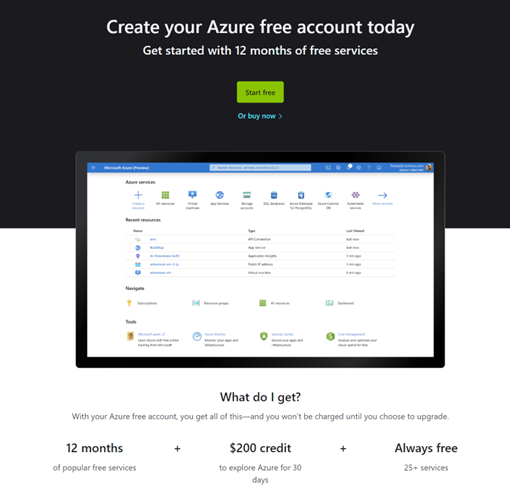

https://signup.azure.com/signup?offer=ms-azr-0044p&appId=102&ref=azureplat-generic&redirectURL=https%3A%2F%2Fazure.microsoft.com%2Fen-us%2Fget-started%2Fwelcome-to-azure%2F&l=en-us&correlationId=4fb68cb5b20240c884a3e2ac0f885a90
Make sure you are logged in with the same account you created the Microsoft 365 E5 trial with

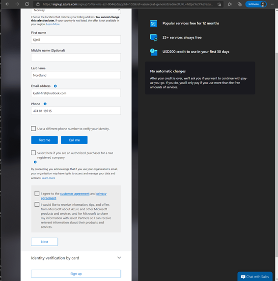

- Verify your phone number by clicking “text me”

- Agree to the licensing terms and click next
- You will need to register a valid Credit Card.

- Click “sign-up”

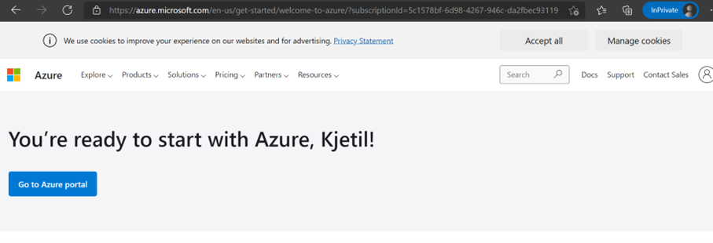

Under Subscriptions in the Azure portal you should now se a Azure Subscription:

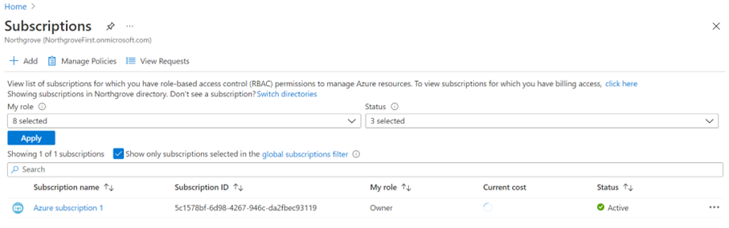

### SETUP OF MICROSOFT SENTINEL
Create a Microsoft Sentinel workspace:
In the search bar in portal.azure.com, search for “Sentinel” and click “azure sentinel”:
 
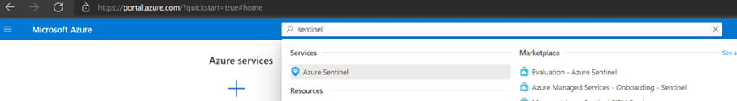
 
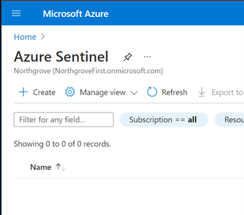

Click “create” or “create azure sentinel”

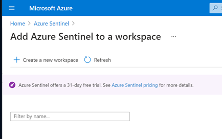 

Create a new workspace

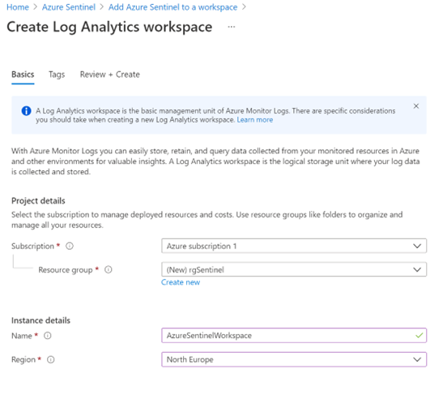 

Create new resource group, choose a region and name your log analytics workspace
Click Create

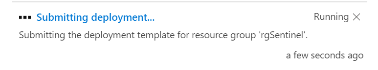 

Wait for deployment to be ready – and your Log Analytics workspace will show up in the workspace list
 
Choose the workspace and click “add”

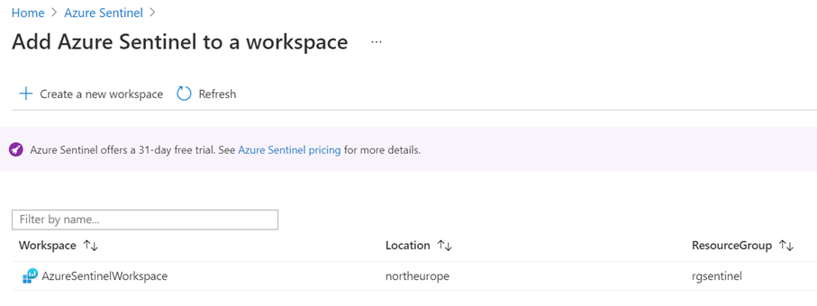 

Wait for Microsoft Sentinel to be provisioned

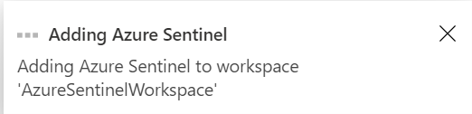 

Microsoft Sentinel is ready to use

### CONFIGURATION OF MICROSOFT SENTINEL

**Connect M365 Defender to Sentinel**

**Create Analytics rules**

### TEST SCENARIO
**Create a test alert to see it appears in Sentinel**
 
