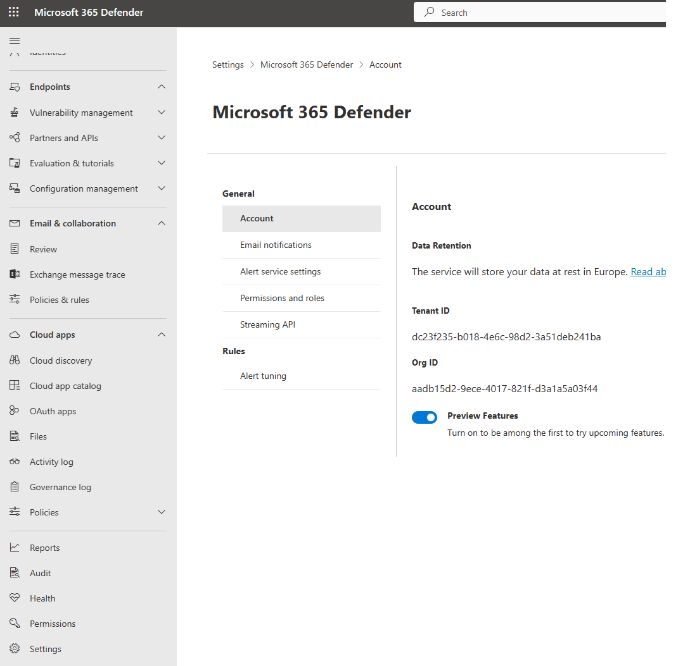

# Microsoft 365 Defender Training Workshop

Attendees will get an opportunity to try their hands at configuration, detection and security analysis using MS tools such as the Microsoft 365 Defender products and Microsoft Sentinel.
The workshop is aimed at security analysts and technical staff looking to learn or get more out of the security consoles provided within the Microsoft E5 suite.
Best Practices for configuration of Defender for Endpoints, Defender for Office and Defender for Cloud Apps will be covered, as well as analysis and mitigation of real attack scenarios.
 
 
The workshop is created by Kent Husvik and Kjetil Nordlund from Microsoft Norway. 

 
 
 

## Preparation and prerequisites
---
There will be required to do some necessary preparation in forehand of attending the workshop. 

> ***These preparation should be completed minimum 24houres before the workshop starts.***

During the workshop you must have access to a trial environment not used before.   
<b>This should not in any circumstances be an existing production environment</b>

 
Pre-requisite for completing the LAB/Course there is a requirement for having access to two Machines.  

One for accessing the Portals and another for testing purposes.  

For Portal Access you will need a supported Browser installed, Microsoft Egde (Chomium based) or Google Chrome is supported, Firefox can work but is not supported.   

**For completing LAB/Tests a Windows 10/11 Pro or Enterprise is required. The machine must be newly installed physical machine or Virtual machine (Local, ESXI, Hyper-V etc.) The machine is going to be enrolled in to Intune (MDM), make sure to not domain join or adding the machine to any other MDM tool before the course.**  

Make sure that **no sensitive or critical information** is stored on your LAB machine, and that it's **not part of any production environment**. After the LAB this machine should be deleted and scraped.

> Tip! If you absolutly have no other options, it is possible to use the machine generated in the "evaluation lab" in M465 Defender / Defender for Endpoint.

 
 

### Registration of an trial tenant
---
Create a New Email account, like Outlook.com or any other that you like.  
Create a [M365 E5 Trial](https://signup.microsoft.com/Signup?OfferId=f6f20264-e785-4749-bd8e-884bab076de4&ali=1) and connect it to the newly created Email account  
Use the newly created email account in the registration form  
  

  
  
  
  
  
  

Complete the wizard.  
Click on Get Started complete the steps required on Data storage location. If any service error message are being displayed, wait a few minutes on the backend provisioning and try again.  
 
 

### Security Console Welcome wizard
---
Navigate in a supported browser to [Security.microsoft.com](https://security.microsoft.com) and complete the wizard.  
Make sure you are loged in with the user you just created a trial teant with.  

Browser requirements: https://docs.microsoft.com/en-us/microsoft-365/security/defender-endpoint/minimum-requirements?view=o365-worldwide  

Take some time and browse around in the console. I.e; Click on "devices"
Expect to find some "Hang on! We're preparing new spaces for your data and connecting them" messages. But its important to gets things triggered (by clicking on them)

 
 

### Turn on preview features and other features
---
Verify that the preview experience setting are turned on. To be among the first to try upcoming features.
1.	In the navigation pane, select Settings > Microsoft 365 Defender> Account > Preview features.  
   
 

2.	Find your way back to Settings > Endpoints > Advanced features 
3.	Activate all features Except “Restrict correlation to within scoped device groups”
4. Click on "save preferences" at the bottom
   

 
 

### Turn on auditing
---
1.	If auditing is not turned on for your organization, you can turn it on in the Microsoft 365 compliance center or by using Exchange Online PowerShell. It may take several hours after you turn on auditing before you can return results when you search the audit log.
2.	Use the compliance center to turn on auditing
3.	Go to https://compliance.microsoft.com and sign in.
4.	In the left navigation pane of the Microsoft 365 compliance center, click Audit.
5.	If auditing is not turned on for your organization, a banner is displayed prompting you "start recording user and admin activity".  
  
7.	Click the Start recording user and admin activity banner.
8.	It may take up to 60 minutes for the change to take effect.

 
 

### Test users and groups
---
Create at least three regular users in your Azure AD tenant in addition to your Global Administrator user created when activated the tenant.  
Create at least three Azure AD groups in your Azure AD tenant.
 
 

### Turn of Security Defaults
---
To be able to test Conditional Access policies, the default enabled “Security Defaults” need to be turned off first.
Disabling Security Defaults: https://docs.microsoft.com/en-us/azure/active-directory/fundamentals/concept-fundamentals-security-defaults#disabling-security-defaults    
  
  
To disable security defaults in your directory:
1.	Sign in to the Azure portal as a security administrator, Conditional Access administrator, or global administrator.
2.	Browse to Azure Active Directory > Properties.
3.	Select Manage security defaults.
4.	Set the "Security defaults" toggle to Disabled.
5. Choose "My organization is using Conditional Access"
6.	Select Save.
7. Confirm by clicking "disable"

 
 

### Enable Basic Conditional Access Policies
---
To maintain the security level in your Azure AD tenant, create one Conditional Access policy enforcing MFA for all your users.  
NB! Make sure your Global Admin users (and other test users) is enrolled with MFA information before you activate MFA requirement for all users.
https://mysignins.microsoft.com/security-info   
  
Follow these steps to create a Conditional access policy requiring MFA for all users:   
https://docs.microsoft.com/en-us/azure/active-directory/conditional-access/howto-conditional-access-policy-all-users-mfa#create-a-conditional-access-policy  
Make sure its enabled (after you have registered MFA info on your admin account)

> Tip! To regsiter SMS MFA option on your test account you can use your admin account and register phone number as "authentication methods" on your test accounts from the AAD console. (NB! Admin accounts need to be member of the "user administrator" role.) 

In addition, create one Conditional Access policy to block use of all Legacy authentication protocols in your tenant.

### Device enrollment preparation

1. Goto https://endpoint.microsoft.com
2. Goto Devices > Enroll devices > automatic Enrollment
3. change "MDM user scope" and "MAM user scope" to "All"
4. Click "Save"

 

### Enable the Defender for Endpoint Evaluation LAB
1. Go to https://security.microsoft.com
2. Go to the "Endpoints" section in the left menu. Expand "Evaluation & tutorials"
3. Click on "Evaluation lab".
4. Click on "setup lab"
    
5. Choose "8 devices for 24h each" (if you dont have any big reason to choose something else)
6. click next
      
7. Consent for Microsoft privacy statement (each link must be clicked and accepted befor checking the box)
8. Consent to the licensing agreement for AttackIQ and SafeBreach
9.  Add your Email, First name, last name
10. click next
       
11. click setup lab
   
(dont use all your 8 devices before the workshop day, they will only exist for 24h before they are deleted)